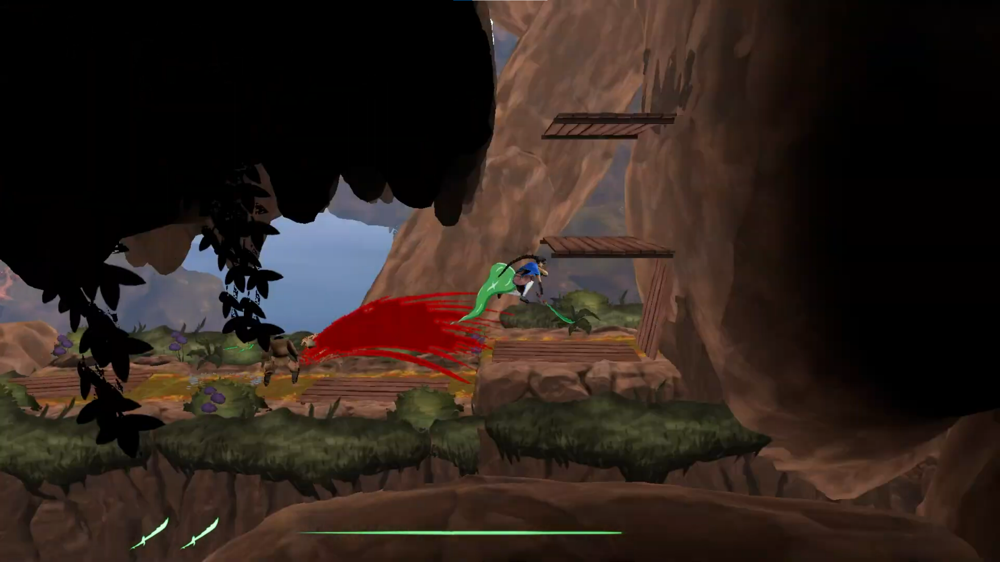

## Overview
Intense 2D Hack/Slash Sidescroller where my main responsibilites included VFX, and Scripted Events tied to the player progression.

---
## Start

This was the first project in our education where we began working in their propertiety engine "The Game Engine". This meant we would have to start implementing features almost completely from scratch, and we had a strong picture of what we wanted to do within the first weeks. We wanted every pipeline worked out and visible in-game. Of course, there was no "game" the first two weeks, but we quickly nailed down asset loading, animations, VFX, and even Audio in the first sprint. There was even a rudamentary moving enemy moving across the screen.

---
## VFX

I was working closely with the Procedual Artists in the beginning of the project. This meant I was working on proving the VFX pipeline. Since the game was 2D, a simple sprite flipbook was perfect for our game. I called it a "VFXSystem", but it was really just a Singleton that took in a type of Flipbook, size, spawnpoint, rotational offset, and wether or not it would follow an object or not. This worked perfectly for the scope of our game. We could have blood splatter from our enemies, dust when we ran or landed, or sword swipes and dash-lines following the player.

Of course, it was very rigid. It was the first time I had worked in C++ on such a large scale, and the functions became overly long and eventually complex as we wanted more functionality. With the knowledge I have now, I would've instead made more overloads, or given the chance to create a struct that holds data so you can access the things you want to change, instead of specifying everything explicity in the function.

---
## Scripted Events

For our scripted event we wanted to have an enemy fall down from the mountain and drop a key for the player, so they could enter a dungeon. There's an inside joke about this "Falling Man" event within our group, it was a while until I was able to let the task go, partly because I was confident in how fast I would be able to implement it. Of course, I greatly underestimated how much work goes into making one when there's so little to work with. First and foremost I had to create states for the player: ones where they were free to move, and a "non-interactive" state that would null all movement input and momentum. Then, I had to create a camera controller that would follow and lerp to points of interests so we could lead the player. I also needed a text-system that would describe certain key points, such as "The Guard dropped a key!" in the case of our scripted event, since we deemed it to be easier than modelling and creatign an object for the key, that, and text is much more re-usable (which we eventually did use for our tutorials). Lastly came the falling man, of course. He was instaniating at the top of the mountain, played some audio when he fell, and then was animated when he landed the ground (with a fancy puff of dirt and dust from my VFX system). 

Perfect, right?

Of course there were issues. Not only would this repeat every time we exited and re-entered the area, but the falling man followed you into different levels. Every single "scene" we had now had its own falling man. You would constantly get interrupted by the camera panning over with a scream, until he just landed somewhere in your level. This was of course because we were in the middle of working on our persistence flags in the game, and even our asset loading/unloading, which I got to dip my toes into to solve this issue. To this day it's among the funniest bugs I've encountered.

Lastly of course, was the chery on top, of getting to unlock the iron gate which allowed you to continue into the dungeon, and eventually climb the mountain to fight the boss in our game.