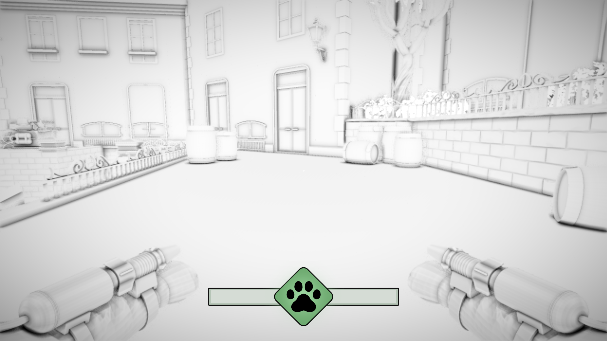
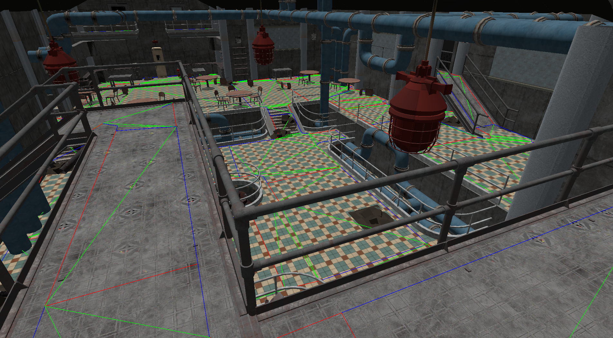

## Overview

This post covers my work contributing to the RabbitHole Engine, our in-house C++ renderer using DX11. Over the course of multiple projects I added point lights, screen-space ambient occlusion, a navigation mesh system, and learned how to manage shader state through constant buffers in HLSL. This features less code and more of a showcase on how the projects has evolved along with the engine throughout these three projects and the results of it.

## Point Lights and SSAO

First implementation of point lights (forward rendered in batch) and non-blurred SSAO in the early stages of Project 5, Spite: Depth of Darkness, a Diablo inspired adventure game. You can see the immediate effect the light and contact shadows has to make the environment feel less flat.

<video autoplay muted loop playsinline preload="metadata" width="100%">
  <source src="SSAOandLights.mp4" type="video/mp4">
  Your browser does not support the video tag.
</video>

The playable character had a separate shader that was exempt from the implementation in this example.

By Project 7, Skyline Feline, an FPS parkour game both systems had been revisited. The SSAO now uses mipmapping as a blur pass, which avoids a dedicated blur shader and keeps the cost lower while still softening the harsh contact shadows from the first pass. The point lights were also pulled out of forward rendering entirely and moved into a deferred pipeline, sampling the G-buffer instead. The difference is visible mostly in how the lights layer on top of each other without the overdraw cost that was building up in the forward pass.

The new SSAO gave a more "cartoony" look, perfect for our project that features parkouring cats shooting water at dogs in cardboard turrets.

---

## NavMesh

The NavMesh I created was also worked on between multiple projects. Originally developed in part by other programmers on my team, I eventually took over and maintained it for the better half of Project 5 and the entirety of Project 6.
The NavMesh itself is triangle-based. Each triangle in the mesh becomes a node, and nodes that share an edge are connected. A* runs over those nodes to find a path, then a funnel algorithm narrows that path down from a corridor of triangles into a clean list of waypoints.
The first big problem I ran into was vertical ambiguity. When querying which triangle a point belongs to, the mesh had no way to distinguish between two triangles stacked at different heights at the same XZ coordinate a floor and a balcony above it would both be candidates. The fix was to project the query point onto each triangle's surface using barycentric coordinates, measure the vertical distance to that surface, and always prefer the closest one. If no triangle contained the point directly, it fell back to the nearest boundary edge weighted by vertical distance, so agents on ledges or near walls would still resolve cleanly.

The second problem came in Project 6 with sub-level stitching. Each sub-level had its own NavMesh baked separately, and rebuilding one giant mesh every load would have been too expensive. Instead, when an additional mesh was loaded in with an offset applied, I collected the boundary edges of each region edges that only belong to a single triangle, meaning they sit on the outer rim of a mesh found the closest pair of boundary edges between the two regions within a vertical and horizontal threshold, and generated two bridge triangles between them. After appending those triangles, nodes and connections were recalculated, and A* could now traverse across what were previously two completely disconnected meshes. You can read more about and see the implementation in its dedicated section in [BotOps](/AlexanderMelander/posts/botops/)

---

## HLSL Shaders and Constant Buffers

Helping our technical artists to set up buffers for their shaders have been one of my main responsibilities throughout the three projects, and this has helped them create some seriously awesome stuff. This has mostly been values such as entity position, stats, and other values such as object lifetime and and instancing so they can create VFX shapers on objects. But in some cases this required me to rewrite how objects where handled or how we persistently saved or handled these buffers. A constant buffer is a block of data that lives on the GPU and stays constant for the duration of a draw call. In HLSL you declare one as a cbuffer, and on the C++ side you write to it by mapping a GPU buffer, copying your struct into it, and then binding it to whichever shader stage needs it. The shader can then read from it freely without any per-vertex or per-pixel cost, since the data doesn't change mid-draw. Our artists are *really* good at what they do, I only helped provide the framework that they needed, but they created stunning visual effects:

<video autoplay muted loop playsinline preload="metadata" width="100%">
  <source src="Effects.mp4" type="video/mp4">
  Your browser does not support the video tag.
</video>

This short instance shows a lot of it in work, and most of these are continuous buffers sending data such as when a shot was last fired, an enemy was hit, or how long it has been alive. You can see the disentigration when the enemy dies, and the opposite effect when the spawn in the distance. Additionally, a lot of the spawned VFX are actually just planes with custom shaders where we instaniate in the world, a much cheaper alternative than a particle system. And with our artists being able to create their own custom shader and applying them to any object in the editor, testing out new effects was really simple.

---
## Component System

The engine doesn't use an ECS. Instead, GameObjects own a list of components that get slotted onto them, a bit like a coin slot you push a component in and the object just has that behaviour from that point on. Components can be queried back off any object at any point using AccessFirstComponentOfType<T>(), which walks the list and returns the first match. It's simple and it works well at this scale and we figured that we couldn't afford the development of it this time around, something like this would be faster to onboard the rest of the team to.

 Adding a PlayerController, an EnemyController, or an AnimatedModelComponent to an object is the same operation regardless of what the component does, and nothing needs to know about the others. The tradeoff compared to a real ECS is that there's no data locality or batch processing components are heap allocated individually and iterated by pointer but for a project of this size that never became a bottleneck.

Most of my work interfacing with the system came down to a few recurring patterns. Separating Init and Start was important early on Init constructs and wires up the component, while Start runs once everything in the level is loaded, so components can safely reference each other without worrying about initialization order. Accessing and removing objects at runtime went through the level rather than directly, so deletions got deferred to the end of the frame and nothing would pull a pointer out from under an object mid-update. And then updating the entity buffers before each draw, pushing per-object data like world position, lifetime, and object ID into a constant buffer so shaders could read it that was the bridge between the component system and the GPU.

Creating a real ECS is something I want to do sometime in the near future.