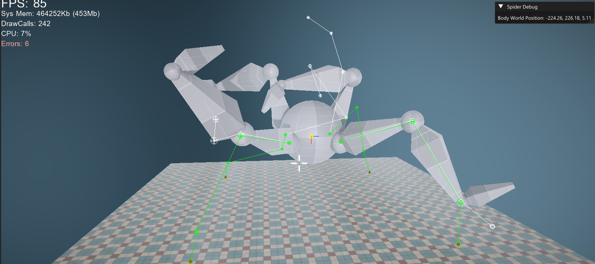

## Overview

This post covers my journey in building a four-legged robotic spider that can walk on uneven surfaces using inverse kinematics in C++ by using F.A.B.R.I.K, an industry standard method implemented in engines such as Unreal and Unity.

<video autoplay muted loop playsinline preload="metadata" width="100%">
  <source src="Spider.mp4" type="video/mp4">
  Your browser does not support the video tag.
</video>

## Goal

The spider has several legs, and each leg should behave like a small chain of joints. The body needed to move independently, but the feet should remain planted on the terrain even at differing heights. 
To do that, I used FABRIK, which is a positional inverse kinematics solver, and is conceptually very simple and cheaper than alternatives.

---

## Building the Leg Chains

Each leg is represented as a set of joint indices from the skeleton. The last joint is the foot or end effector, which we will move to the target, then iteratively reposition the rest of the chain during backward and forward passes while preserving segment lengths.

{}
```cpp
    for (size_t legIndex = 0; legIndex < myLegChains.size(); ++legIndex)
    {
        SpiderLegChain& legChain = myLegChains[legIndex];

        IKChain originalChain = BuildIKChainFromLeg(legChain, referenceModelSpacePose);
        IKChain solvedChain   = originalChain;

        const Tga::Vector3f footTargetWorld = BuildFootTarget(legChain, originalChain, aDeltaTime, static_cast<int>(legIndex));

        //lift the middle joints before solving to bias FABRIK toward
        //a natural upward knee bend instead of collapsing underneath
        //for the scope of this project, it works in lieu of constraints!
        LiftChainForSolve(solvedChain, JOINT_Y_OFFSET, footTargetWorld);
        FABRIKSolver::Solve(solvedChain, footTargetWorld, MAX_ITERATIONS, TOLERANCE);
        ApplySolvedChainToPose(legChain, solvedChain, localPose);

#ifdef _DEBUG
        SpiderLegDebugDraw debugDrawData;
        debugDrawData.originalChain   = originalChain;
        debugDrawData.solvedChain     = solvedChain;
        debugDrawData.footTargetWorld = footTargetWorld;
        myDebugLegDrawData.push_back(debugDrawData);
#endif

        //update modelSpacePose after each leg so the next leg's ApplySolvedChainToPose
        //reads parent rotations that already include the previous leg's contribution
        mySkeleton->ConvertPoseToModelSpace(localPose, modelSpacePose);
    }
```
{}
But before running FABRIK, you need to convert the current animated pose into model space and then into world space so you can get a chain of actual positions. Luckily I was working in our own engine, which already had ways to store our skeleton and poses in our AnimatedModelComponents, so all I really had to change before I could get to work was to save away the default pose when it was missing animations and save it into a new struct **SpiderLegChain**. After that, I had a nice default pose to start working with.
{}
```cpp
Tga::Vector3f Spider::BuildFootTarget(SpiderLegChain& aLegChain, const IKChain& aChain) const
{
    auto& navMesh = Singletons::GetLevelHandler().GetActiveLevel()->GetNavmesh();
    const Tga::Matrix4x4f& spiderWorldTransform = myAnimatedModel->GetTransform();

    if (!aLegChain.hasPlantedFootTarget)
    {
        const Tga::Vector3f footWorldPosition = aChain.jointPositionsWorld.back();

        aLegChain.restOffsetLocalSpace = WorldToLocalPoint(spiderWorldTransform, footWorldPosition);

        aLegChain.plantedFootTargetWorld = footWorldPosition;
        aLegChain.plantedFootTargetWorld.y = navMesh.GetHeightOfPoint(aLegChain.plantedFootTargetWorld);
        aLegChain.hasPlantedFootTarget = true;

        return aLegChain.plantedFootTargetWorld;
    }

    const Tga::Vector3f naturalFootPositionWorld = LocalToWorldPoint(spiderWorldTransform, aLegChain.restOffsetLocalSpace);
    Tga::Vector3f desiredStepTargetWorld = naturalFootPositionWorld;
    desiredStepTargetWorld.y = navMesh.GetHeightOfPoint(desiredStepTargetWorld);

    aLegChain.plantedFootTargetWorld.y = navMesh.GetHeightOfPoint(aLegChain.plantedFootTargetWorld);

    const float distanceFromNaturalToPlanted = (aLegChain.plantedFootTargetWorld - desiredStepTargetWorld).Length();
    const float maxDriftBeforeStep = 20.0f;
    if (distanceFromNaturalToPlanted > maxDriftBeforeStep)
    {
        aLegChain.plantedFootTargetWorld = desiredStepTargetWorld;
    }

    return aLegChain.plantedFootTargetWorld;
}
```
{}
---

## Solving with FABRIK
At this point, things are still relative simple. Taking one leg at a time, I convert what we've stored from the spider into a generic IKChain which holds the joints position and lengths, and total length of the chain.
Extremely short and sweet. And after population the new IKChain, we have everything to sovle it!

The first thing the solver does is handle the simplest edge case, which is when the target is too far away to ever be reached. If the distance from the root joint to the target is greater than the total length of the chain, then there is no fancy solution to find. The only thing the leg can do is stretch itself out as far as possible in the direction of the target.

The solve works in two passes that repeat over and over until the foot is close enough to the target. The end effector is snapped directly onto the target, because that is ultimately where I want the chain to end. Then the solver walks backward through the leg, moving each earlier joint so that it stays the correct distance away from its child.

The backward pass gets the foot where it should go, but it can pull the root away from where it belongs. Since the root joint is supposed to stay anchored to the spider’s body, the solver now snaps the root back to its original position and walks forward through the chain again. This time, each child joint is repositioned so that every segment length is preserved from the root outward.

{}
```cpp
bool FABRIKSolver::Solve(IKChain& aChain, const Tga::Vector3f& aTargetWorld, int aMaxIterations, float aTolerance)
{
    const int jointCount = static_cast<int>(aChain.jointPositionsWorld.size());
    if (jointCount < 2)
    {
        return false;
    }

    const Tga::Vector3f originalRootPosition = aChain.jointPositionsWorld.front();
    const float distanceFromRootToTarget = Length(aTargetWorld - originalRootPosition);

    if (distanceFromRootToTarget > aChain.totalLength)
    {
        for (int jointIndex = 0; jointIndex < jointCount - 1; ++jointIndex)
        {
            const Tga::Vector3f& currentJointPosition = aChain.jointPositionsWorld[jointIndex];
            const float segmentLength = aChain.segmentLengths[jointIndex];
            const Tga::Vector3f directionToTarget = NormalizeSafe(aTargetWorld - currentJointPosition);
            aChain.jointPositionsWorld[jointIndex + 1] = currentJointPosition + directionToTarget * segmentLength;
        }

        return true;
    }

    for (int iteration = 0; iteration < aMaxIterations; ++iteration)
    {
        aChain.jointPositionsWorld.back() = aTargetWorld;

        for (int jointIndex = jointCount - 2; jointIndex >= 0; --jointIndex)
        {
            const float segmentLength = aChain.segmentLengths[jointIndex];
            aChain.jointPositionsWorld[jointIndex] = MoveToDistance(aChain.jointPositionsWorld[jointIndex + 1], aChain.jointPositionsWorld[jointIndex], segmentLength);
        }

        aChain.jointPositionsWorld.front() = originalRootPosition;

        for (int jointIndex = 0; jointIndex < jointCount - 1; ++jointIndex)
        {
            const float segmentLength = aChain.segmentLengths[jointIndex];
            aChain.jointPositionsWorld[jointIndex + 1] = MoveToDistance(aChain.jointPositionsWorld[jointIndex], aChain.jointPositionsWorld[jointIndex + 1], segmentLength);
        }

        const float remainingDistance = Length(aTargetWorld - aChain.jointPositionsWorld.back());
        if (remainingDistance <= aTolerance)
        {
            return true;
        }
    }

    return true;
}
```
{}

At the end of each iteration, the solver checks how far the end effector still is from the target. If that remaining distance is smaller than the tolerance, then the solve stops early because the result is already good enough.

With this data I can now visualize the spiders bones and joints by drawing them out. To help me along the way I wanted two things: A way to visualize the pre-solved joints joints, and the solved one, and a way to pause and step through each iteration of the Spider moving. With these two simple but invaluable debug it became much easier to digest the problems that began to appear.



Well, that doesn't look right!

---

## Rebuilding the Mesh

The debug lines looked perfect. The solved chain was clean, the foot was landing exactly where it should, and I felt like I was basically done.

I had assumed the rig would just follow the solved positions automatically, but all I had really solved was the actual vector part. FABRIK gives you a chain of points in space, nothing more. The mesh is driven by bone transforms, which means rotations, and that's an entirely different problem. A distinction that sounds minor until you're staring at a spider that's folding in on itself. Solving the positions was the easy part. Making the actual rig follow without tearing itself apart was where the real work started since I hadn't looked a whole lot into animations and how skeletal meshes actually worked yet.

It was exciting to learn, and the concept clicked pretty fast once I sat down with it. A skeletal mesh is just a hierarchy of bones, each with a local transform relative to its parent. When you want to know where a bone actually sits in the world, you walk up that hierarchy and multiply the transforms together. That chain of multiplications is what converts a local space pose into model space, and then into world space.

{}
```cpp
void Spider::ApplySolvedChainToPose(const SpiderLegChain& aLegChain, const IKChain& aSolvedChain, Tga::LocalSpacePose& aLocalPose) const
{
    Tga::ModelSpacePose currentModelSpacePose{};
    mySkeleton->ConvertPoseToModelSpace(aLocalPose, currentModelSpacePose);

    const Tga::Matrix4x4f spiderWorldTransform = myAnimatedModel->GetTransform();

    for (size_t chainJointIndex = 0; chainJointIndex + 1 < aLegChain.jointIndices.size(); ++chainJointIndex)
    {
        const int currentSkeletonJointIndex = aLegChain.jointIndices[chainJointIndex];
        const int childSkeletonJointIndex = aLegChain.jointIndices[chainJointIndex + 1];
        const int parentSkeletonJointIndex = mySkeleton->Joints[currentSkeletonJointIndex].Parent;

        Tga::Vector3f currentDirectionWorld = GetJointWorldPosition(currentModelSpacePose, childSkeletonJointIndex) - GetJointWorldPosition(currentModelSpacePose, currentSkeletonJointIndex);
        Tga::Vector3f solvedDirectionWorld = aSolvedChain.jointPositionsWorld[chainJointIndex + 1] - aSolvedChain.jointPositionsWorld[chainJointIndex];

        if (currentDirectionWorld.LengthSqr() <= 0.0001f || solvedDirectionWorld.LengthSqr() <= 0.0001f)
        {
            continue;
        }

        currentDirectionWorld.Normalize();
        solvedDirectionWorld.Normalize();

        //figure out how far the joint needs to rotate to match the solved direction
        const Tga::Quaternionf worldDeltaRotation = Tga::Quaternionf::CreateFromTo(currentDirectionWorld, solvedDirectionWorld);

        //model space accumulates the full parent chain, so the model space rotation
        //of the parent IS its world rotation when the spider itself has no rotation.
        //for the root joint there is no skeleton parent, so the spider world transform is the parent
        const Tga::Quaternionf parentWorldRotation = (parentSkeletonJointIndex >= 0)
            ? currentModelSpacePose.JointTransforms[parentSkeletonJointIndex].GetRotationAsQuaternion()
            : spiderWorldTransform.GetRotationAsQuaternion();

        const Tga::Quaternionf parentWorldRotationInverse = parentWorldRotation.GetConjugate().GetNormalized();

        //row-vector sandwich to convert the world delta into local space:
        //q_parent * worldDelta * inv(q_parent)
        const Tga::Quaternionf localDeltaRotation = parentWorldRotation * worldDeltaRotation * parentWorldRotationInverse;

        Tga::ScaleRotationTranslationf& jointLocalTransform = aLocalPose.JointTransforms[currentSkeletonJointIndex];

        //row-vector convention applies delta on the right: old * localDelta
        jointLocalTransform.SetRotation((jointLocalTransform.GetRotation() * localDeltaRotation).GetNormalized());

        //reconvert after each joint so the next joint reads correct parent transforms
        mySkeleton->ConvertPoseToModelSpace(aLocalPose, currentModelSpacePose);
    }
}
```
{}

I was applying each new IK solution on top of the previous frame's already modified pose, which meant the values kept accumulating and mutating further and further away from the original skeleton. That was why the spider would eventually bend into absurd shapes, why the joint rotations spiraled out of control, and why parts of the leg sometimes looked like they were completely disconnecting from one another.

The fix was to cache the original clean pose and restart from that every frame before applying IK. As soon as I did that, the result became dramatically more stable. That did not solve every remaining issue with reconstruction or rotation, but it removed the feedback loop that had been corrupting the entire leg system over time. Once that was under control, I could finally move on to the more interesting part, which was improving how the spider actually stepped and moved across the terrain.

It was mostly cleaning up magic numbers and tweaking tolerances, speeds, and other values I had already established, and adding leg groups so the spider would walk "realistically", meaning one front and one back leg at a time. Which lead the result you saw above.

<video controls preload="metadata" width="100%">
  <source src="Spider.mp4" type="video/mp4">
  Your browser does not support the video tag.
</video>

FABRIK turned out to be one of those things that looks intimidating from the outside but has a surprisingly elegant core once you actually sit down with it. The algorithm itself is only a handful of lines the real work was everything around it, understanding skeletal hierarchies well enough to drive a mesh from solved positions, and chasing down the subtle bugs that come from applying rotations in the wrong space. I'd like to revisit it with proper joint constraints and an ImGui interface for selecting target bones at runtime, but even in its current state it gave me a solid foundation for how IK is actually used in games and a spider that can walk up stairs, which feels like a reasonable thing to have built.